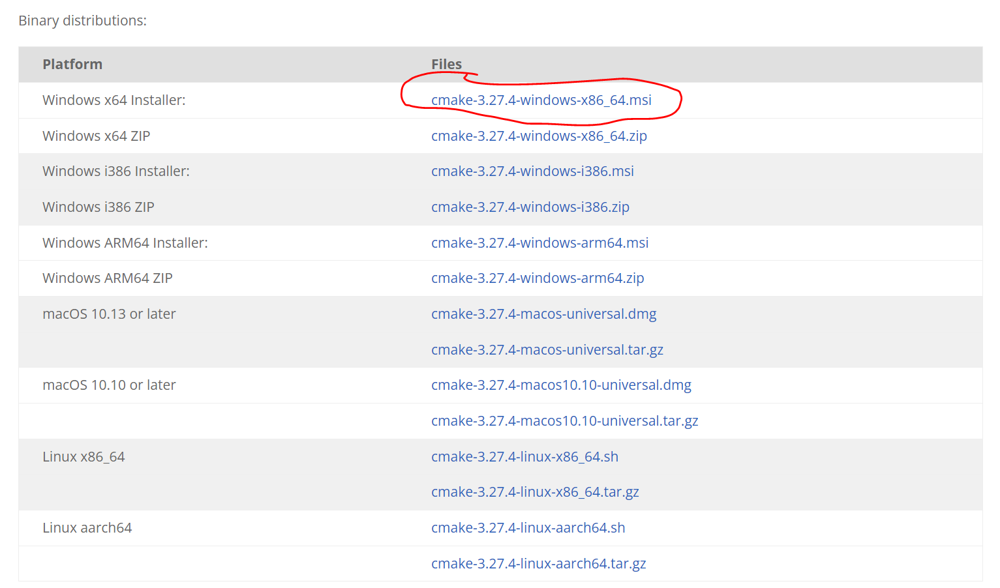

<h1 style="text-align:center">推理</h1>

## llama.cpp

### cmake

https://cmake.org/download/



### llama.cpp

```python
git clone https://github.com/ggerganov/llama.cpp.git
git checkout master-ff966e7
git switch -c ff966e7
```

```python
rm -rf build
mkdir build
cd build
cmake ..  -DBUILD_SHARED_LIBS=ON
cmake --build . --config Release
```

如果最后一条命令遇到错误：
https://github.com/ymcui/Chinese-LLaMA-Alpaca/issues/185

则可以参考：https://blog.csdn.net/diaodaa/article/details/106122943

重新编译


**下载模型**

```python
from huggingface_hub import snapshot_download
snapshot_download(repo_id="baichuan-inc/Baichuan-7B")
```

**转化模型**

```python
python .\convert.py ..\models\Baichuan-7B\
```


```python
.\build\bin\Release\quantize.exe ..\models\Baichuan-7B\ggml-model-f32.bin ..\models\
Baichuan-7B\ggml-model-q4_0.bin q4_
```


**推理模型**

```python
.\build\bin\Release\main.exe -m ..\models\Baichuan-7B\ggml-model-q4_0.bin -p "the weather is"
```


**api**

使用：https://github.com/abetlen/llama-cpp-python

```python
git clone --recursive -j8 https://github.com/abetlen/llama-cpp-python.git
set FORCE_CMAKE=1
set CMAKE_ARGS=-DLLAMA_CUBLAS=OFF
python setup.py clean
python setup.py install
```

bug待解決


