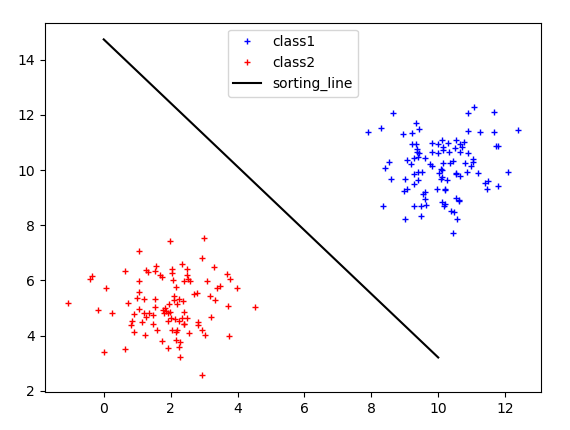
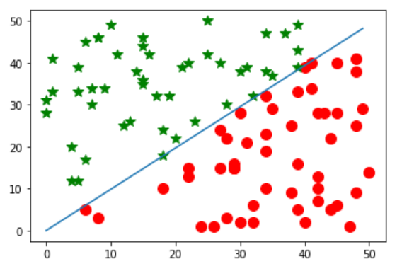

<h1 style="text-align:center">感知机</h1>

感知机是二分类的线性分类模型，属于判别模型。训练基于误分类的目标函数，利用梯度下降法进行优化。

## 理论

### 问题

对于线性可分数据集，求一个超平面将数据划分为两部分。



### 模型

线性模型加符号函数，将实数域转化为二分类。

(1) 原始形式

$$
    f(x)=sign(w \cdot x + b)
$$

(2) 对偶形式

$$
    f(x)=sign(\sum_{j=1}^{N} {\alpha_j}{y_j}{x_j} \cdot x + b)
$$

### 训练

当一个实例点被误分类，即位于分离超平面的错误一侧时，则调整$w,b$的值，使分离超平面向该误分类点的一侧移动，以减少该误分类点与超平面的距离，直到超平面越过该误分类点使其被正确分类。

**(1) 原始形式**

- 目标函数

$$
    L(w,b)=-\sum_{x_i \isin M}y_{i}(w \cdot x_{i} + b)
$$
其中$M$为误分类点的集合。

- 学习算法

输入：训练数据集$T=\{(x_1,y_1),(x_2,y_2),\cdot\cdot\cdot(x_N,y_N)\}$

输出：$w,b$;感知机模型$f(x)=sign(w \cdot x + b)$

1. 选取初值$w_0,b_0$

2. 在训练数据中选取数据$(x_i,y_i)$

3. 如果$y_i(w \cdot x_i + b) \leq 0$,

$$
    w \gets w + \eta{y_i}{x_i}
    \\
    b \gets b + \eta{y_i}
$$

4. 转至2，直到训练集中没有误分类点

**(2) 对偶形式**

将$w$和$b$表示为实例$x_i$和标记$y_i$的线性组合的形式，通过求解其系数得$w$和$b$。

$$
    w = \sum_{i=1}^{N}{\alpha_i}{y_i}{x_i}
    \\
    b = \sum_{i=1}^{N}{\alpha_i}{y_i}
    \\
    \alpha_i = n_{i}\eta
$$

- 目标函数

$$
    L(w,b)=-\sum_{x_i \isin M}y_{i}(\sum_{j=1}^{N} {\alpha_j}{y_j}{x_j} \cdot x + b)
$$
其中$M$为误分类点的集合。

- 学习算法

输入：训练数据集$T=\{(x_1,y_1),(x_2,y_2),\cdot\cdot\cdot(x_N,y_N)\}$

输出：$\alpha,b$;感知机模型$f(x)=sign(\sum_{j=1}^{N} {\alpha_j}{y_j}{x_j} \cdot x + b)$

1. 选取初值$\alpha \gets 0, b \gets 0$

2. 在训练数据中选取数据$(x_i,y_i)$

3. 如果$y_i(\sum_{j=1}^{N} {\alpha_j}{y_j}{x_j} \cdot x + b) \leq 0$,

$$
    n_i \gets n_i + 1
    \\
    \alpha_i \gets \alpha_i + \eta
    \\
    b \gets b + \eta{y_i}
$$

4. 转至2，直到训练集中没有误分类点

## 面试

(1) 单层感知机无法解决异或问题，那多层感知机在没有sigmoid函数的情况下，能解决异或问题吗

> 可以

(2) 既然多层感知机用sign能解决非线性问题，那为啥要sigmoid函数？

> 激活函数需要满足的条件：
> 
> 1)非线性，处处可导
> 
> 2)导数尽量简单
> 
> 3)导数值域范围固定，以免梯度消失或爆炸
> 
> 所以sigmoid比sign效果更好

(3) 感知机时二分类的线性模型，和多分类、多标签分类有什么区别

> 分类问题：在监督学习中，输出变量取有限个离散值
> 
> 二分类：分类的类别为两个
> 
> 多分类：分类的类别为多个
> 
> 多标签：一个样本存在多个类别

(4) 感知机和SVM的区别

> SVM的基本模型时定义在特征空间上间隔最大的线性分类器，间隔最大使其有别于感知机

## 实践

使用pytorch实现[<sup>3</sup>](#参考)。

```python
import random
import numpy as np
import torch
from torch.nn import Linear, Module
from torch.utils.data import Dataset, DataLoader

class Perceptron(Module):
    """
    感知机模型
    """
    def __init__(self, in_features, out_features):
        super(Perceptron, self).__init__()
        
        self.linear = Linear(in_features, out_features)
    
    def loss(self, feature, label):
        pred = self.linear(feature)
        return -(pred * label)
    
    def forward(self, feature):
        """
        预测
        """
        output = torch.sign(self.linear(feature))
        return output


class PerceptronTrainer:
    """
    感知机训练类
    """
    def __init__(self, in_features, out_features):
        self.model = Perceptron(in_features, out_features)
    
    def train(self, dataloader, lr=1, max_epoch=None):
        """
        训练
        """
        self.model.train()
        optimizer = torch.optim.SGD(self.model.parameters(), lr=lr)
        epoch = 0
        while True:
            count = 0
            for feature, label in iter(dataloader):
                optimizer.zero_grad()
                loss = self.model.loss(feature, label)
                if loss.item() >= 0:
                    loss.backward()
                    optimizer.step()
                    count += 1
            if count == 0:
                break
            
            epoch += 1
            if max_epoch and epoch > max_epoch:
                break
    
    def get_params(self):
        return list(self.model.parameters())
    
    def print(self):
        for name, param in self.model.named_parameters():
            print(f"{name}: {param}")
    
    def save(self, file_path):
        torch.save(self.model.state_dict(), file_path)

class PerceptronPredictor:
    """
    感知机预测类
    """
    def __init__(self, in_features, out_features):
        self.model = Perceptron(in_features, out_features)
    
    def predict(self, feature):
        result = self.model(feature)
        return result
    
    def load(self, file_path):
        self.model.load_state_dict(torch.load(file_path))
        self.model.eval()

        
class PerceptronDataset(Dataset):
    """
    数据集
    """
    def __init__(self, train_data):
        self._data = []
        for data in train_data:
            feature, label = data
            feature = torch.tensor(feature, dtype=torch.float)
            label = torch.tensor(label, dtype=torch.int)
            self._data.append([feature, label])
    
    def __len__(self):
        return len(self._data)

    def __getitem__(self, idx):
        return self._data[idx]
        

# 初始化
def set_seed(seed=2020):
    random.seed(seed)
    np.random.seed(seed)
    torch.manual_seed(seed)
    torch.cuda.manual_seed(seed)
    torch.cuda.manual_seed_all(seed) # if you are using multi-GPU.
    torch.backends.cudnn.benchmark = False
    torch.backends.cudnn.deterministic = True
    torch.backends.cudnn.enabled = False

set_seed()

# 数据集
# datas = [((3, 3), 1), ((4, 3), 1), ((1, 1), -1)]
datas = []
for i in range(100):
    x = random.randint(0, 50)
    y = random.randint(0, 50)
    if x > y:
        datas.append(((x, y), 1))
    else:
        datas.append(((x, y), -1))
train_data = PerceptronDataset(datas)
train_dataloader = DataLoader(train_data, batch_size=1, shuffle=True)

# 训练
trainer = PerceptronTrainer(2, 1)
trainer.train(train_dataloader, max_epoch=20)
w, b = trainer.get_params()
trainer.save("model.pt")

# 预测
predictor = PerceptronPredictor(2, 1)
predictor.load("model.pt")
feature = torch.tensor([[1, 1]], dtype=torch.float)
predictor.predict(feature)

# 画图
from matplotlib import pyplot as plt

def draw(datas, w, b):
    n = len(datas)
    x_list = [0] * n
    x_right_list = []
    y_right_list = []
    x_error_list = []
    y_error_list = []
    for i in range(n):
        (x, y), label = datas[i]
        x_list[i] = x
        if label == 1:
            x_right_list.append(x)
            y_right_list.append(y)
        else:
            x_error_list.append(x)
            y_error_list.append(y)
    plt.plot(x_right_list, y_right_list, 'o' + 'r', label='right', ms=10)
    plt.plot(x_error_list, y_error_list, '*' + 'g', label='error', ms=10)
    
    line_x = np.arange(min(x_list), max(x_list), 1)
    line_len = len(line_x)
    line_y = [0] * line_len
    for i in range(line_len):
        line_y[i] = -(w[0]*line_x[i]+b)/w[1]  # 除0错误
    plt.plot(line_x, line_y)
    plt.show()


draw(datas, w.tolist()[0], b.tolist()[0])
```



## 参考

[1] [统计学习方法](#参考)

[2] [感知机算法面试问题汇总](https://blog.csdn.net/longshaonihaoa/article/details/107234217)

[3] [感知机及Python实现](https://blog.csdn.net/Jeaten/article/details/101202181)
