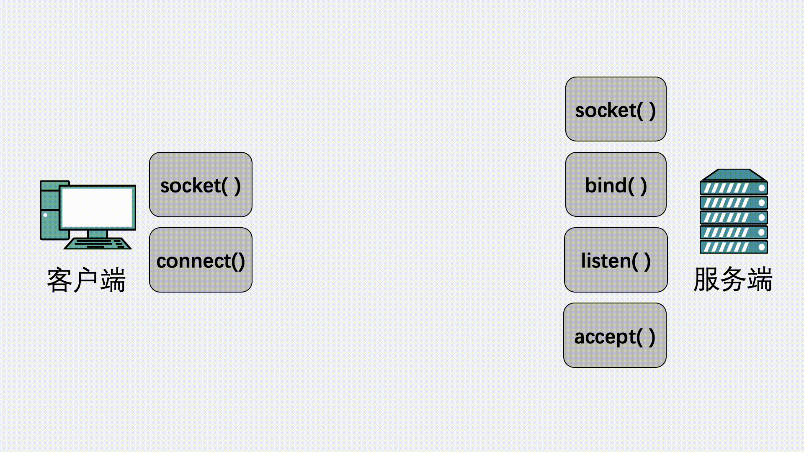
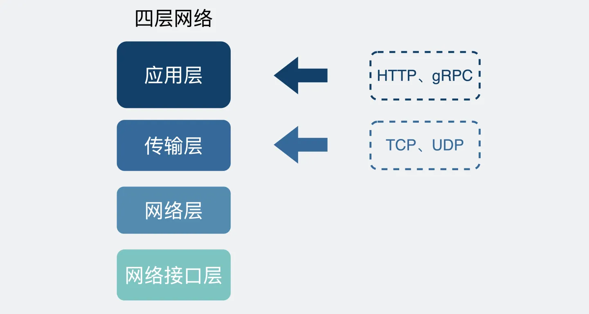

<h1 style="text-align:center">概念</h1>

## TCP、UDP

TCP: 
- 面向连接: 先建立连接再发送数据
- 可靠: 如果数据有丢失则重新发送
- 基于字节流

UDP: 不可靠

## Socket

## HTTP、RPC

- HTTP(Hyper Text Transfer Protocol)
  - 使用统一的标准，方便通信
- RPC(Remote Procedure Call)
  - 传输数据少

TCP + 协议解析 -> HTTP、XRPC

消息边界：消息头

### 区别

- 服务发现
  - HTTP: 通过DNS服务解析域名，得到IP和端口
  - RPC: 专门的中间服务保存服务名和IP信息
- 底层连接形式
  - HTTP: 建立长连接复用
  - RPC: 建立连接池，长连接复用
- 传输的内容
  - HTTP: 使用json序列化结构体: 包含很多冗余内容
  - RPC: protobuf或其他序列化协议: 定制化程度高，体积小

## 连接池

## c/s、b/s
- c/s: client/server: qq客户端跟qq服务端连接
- b/s: browser/server: chrome跟自家服务器和其他公司网站

## 序列化、反序列化
- 序列化: 将结构体转化为二进制数据
- 反序列化: 将二进制数据复原为结构体

## 问题

### 既然有HTTP协议，为什么还要有RPC？

## 参考

[1] [既然有HTTP协议，为什么还要有RPC](https://zhuanlan.zhihu.com/p/543314531?utm_campaign=shareopn&utm_medium=social&utm_oi=1080465881427136512&utm_psn=1571776803236163584&utm_source=wechat_session)
